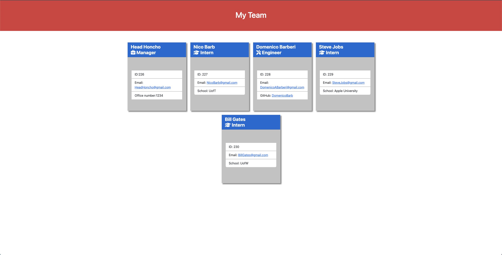

# Team-Profile-Generator

## Table of Contents:

* [Description](#description)
* [Installation](#installation)
* [Usage](#usage)
* [User-Story](#user-story)
* [Acceptance-Criteria](#acceptance-criteria)
* [Screenshot](#screenshot)
* [Demo](#Demo)
* [Email](#Email)
* [Owner](#Owner)

## Description:
This is a Node.js command-line application that takes in information about employees on a software engineering team and generates an HTML webpage that displays summaries for each person.

## Installation:
Type "npm i" into your terminal to download dependencies.

## Usage:
Type "node index" into your terminal to run the application

## User-Story:

```md
AS A manager
I WANT to generate a webpage that displays my team's basic info
SO THAT I have quick access to their emails and GitHub profiles
```


## Acceptance-Criteria:

```md
GIVEN a command-line application that accepts user input
WHEN I am prompted for my team members and their information
THEN an HTML file is generated that displays a nicely formatted team roster based on user input
WHEN I click on an email address in the HTML
THEN my default email program opens and populates the TO field of the email with the address
WHEN I click on the GitHub username
THEN that GitHub profile opens in a new tab
WHEN I start the application
THEN I am prompted to enter the team manager’s name, employee ID, email address, and office number
WHEN I enter the team manager’s name, employee ID, email address, and office number
THEN I am presented with a menu with the option to add an engineer or an intern or to finish building my team
WHEN I select the engineer option
THEN I am prompted to enter the engineer’s name, ID, email, and GitHub username, and I am taken back to the menu
WHEN I select the intern option
THEN I am prompted to enter the intern’s name, ID, email, and school, and I am taken back to the menu
WHEN I decide to finish building my team
THEN I exit the application, and the HTML is generated
```

## Screenshot:


## Demo:
https://user-images.githubusercontent.com/119437696/223020468-03ded9f5-b1bc-45d3-8f78-6696d80e4248.mp4

## Email:
DomenicoABarberi@gmail.com

## Owner:
Domenico Barberi
